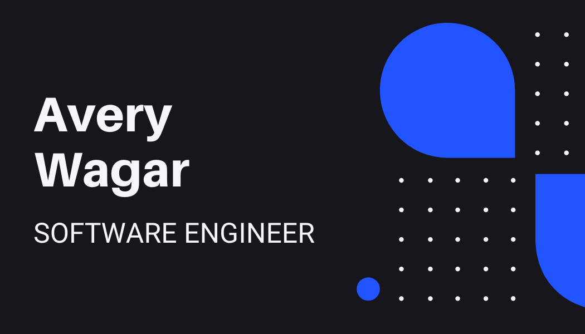

</img>
<!--<h1 align="left">Hi 👋, I'm Avery Wagar</h1>-->
<!--<h3 align="left">I do software development at @Zipwhip</h3>-->

  

- 🏢 I do **software development at [@Zipwhip](https://github.com/Zipwhip)**

- :school: I'm a student at **Ballard High School** and **North Seattle College**

- 🔭 I’m currently working on **setting up my Homelab.**

- 🌱 I’m currently learning **about Micro-controllers and Embedded Software**

- 👯 I’m looking to collaborate on [vim-deus](https://github.com/ajmwagar/vim-deus)

- 📝 I regulary write articles on [https://averywagar.com](https://averywagar.com)

- 💬 Ask me about **Rust, Docker, and Microservices**

### Blogs posts
<!-- BLOG-POST-LIST:START -->
<!-- BLOG-POST-LIST:END -->

<h3 align="left">Connect with me:</h3>

<h3 align="left">Languages and Tools:</h3>

                                      

&nbsp;

